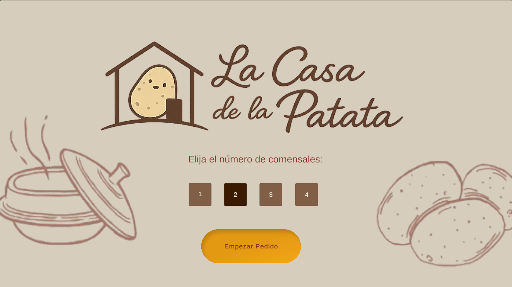
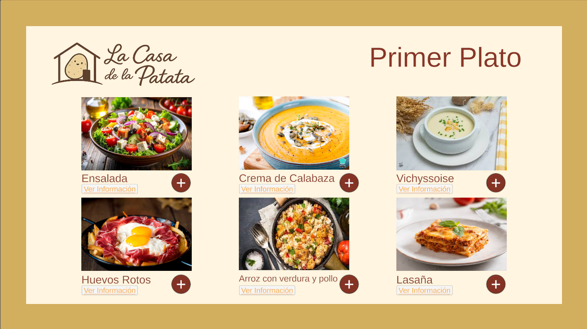
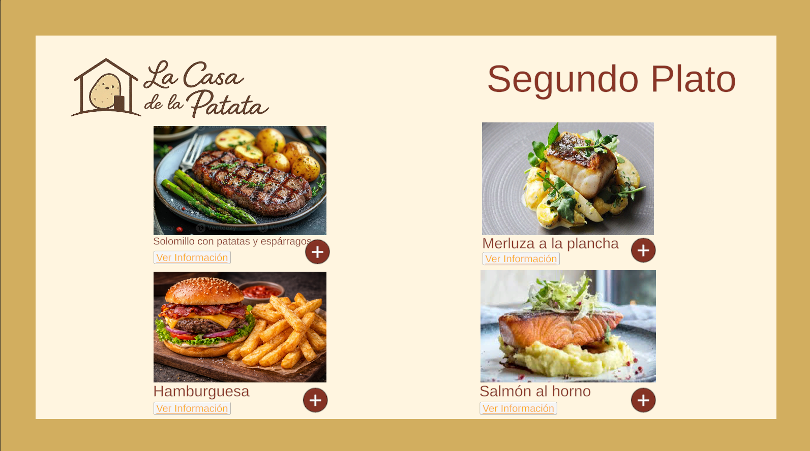
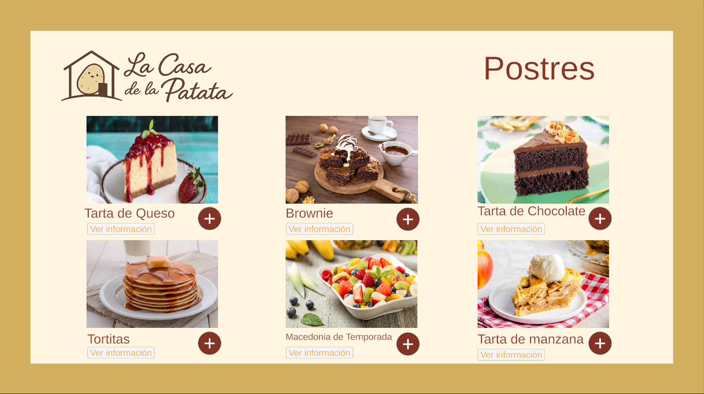
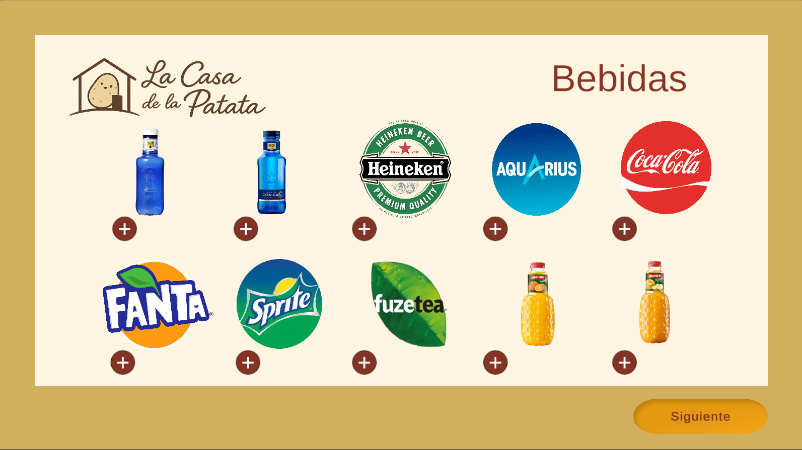
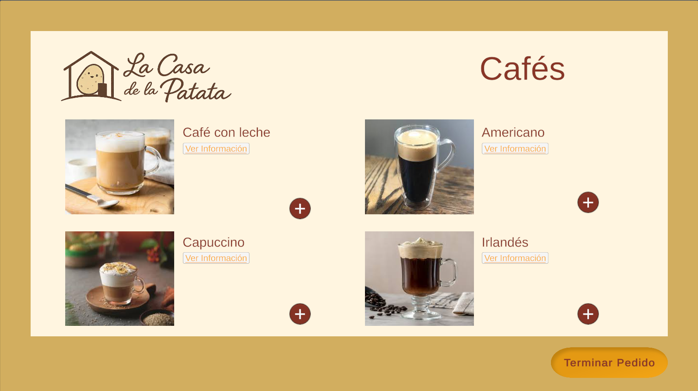
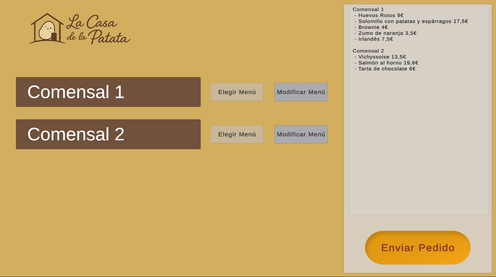
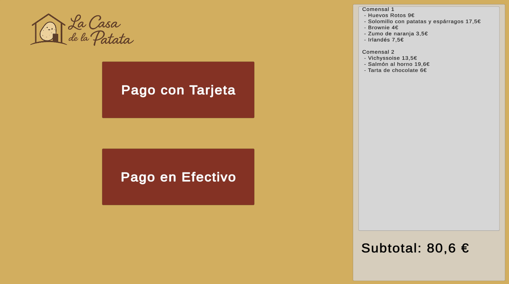
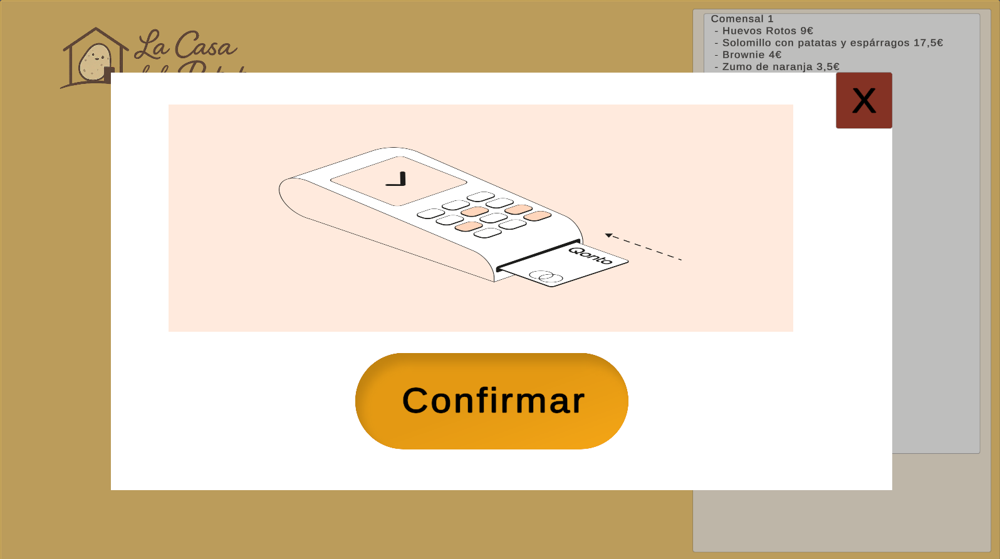

# Interfaz de Aplicación de Restaurante (Unity)

Proyecto desarrollado en Unity centrado en el diseño y la implementación de la interfaz de una aplicación de restaurante. Incluye pantallas básicas de navegación, menús, botones interactivos y estructura modular orientada a una experiencia de usuario clara y sencilla.

## Características principales
- Diseño de interfaz con Unity UI (Canvas, Panels, Buttons, Text).
- Navegación entre pantallas (menú principal, carta, pedidos, etc.).
- Organización modular del proyecto.
- Simulación de servicio

## Tecnologías utilizadas
- Unity
- C#
- Unity UI Toolkit / Canvas

## Estructura del proyecto
- **Assets/**: recursos, escenas, scripts y elementos visuales.
- **ProjectSettings/**: configuración del proyecto.
- **Packages/**: dependencias y paquetes de Unity.

## Capturas

## Estado del proyecto
Prototipo funcional de interfaz, orientado a mostrar diseño, navegación y estructura visual.
